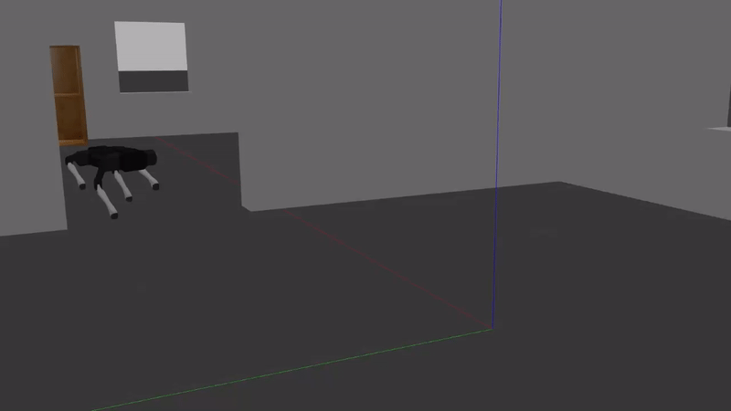
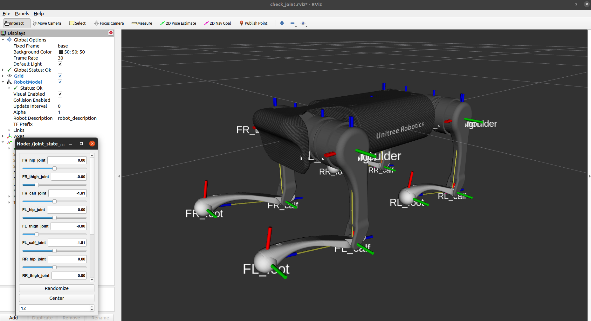
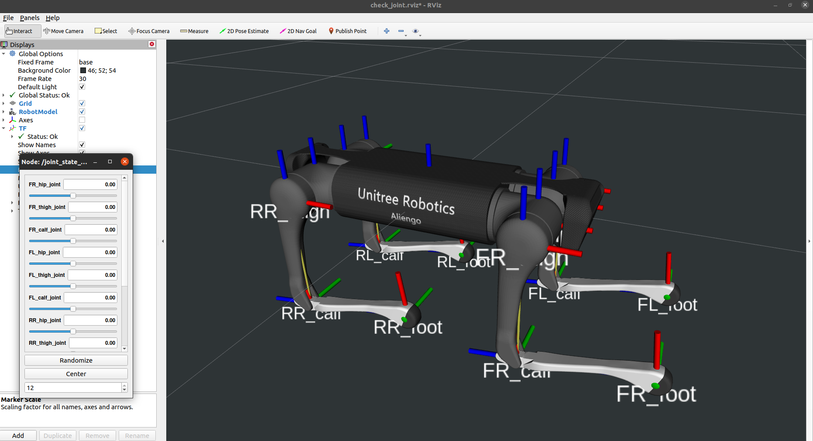

# 🤖 Unitree Quadruped Robot Gazebo Simulation (Aliengo, A1 & Go1)
This repository contains all the files and code needed to simulate the [Aliengo](https://www.unitree.com/aliengo/), [A1](https://www.unitree.com/products/a1) & [Go1](https://www.unitree.com/products/go1) quadruped robots using [Gazebo](http://gazebosim.org/) and [ROS](https://www.ros.org/).
The software runs on [ROS noetic](http://wiki.ros.org/noetic) and [Ubuntu 20.04](http://www.releases.ubuntu.com/20.04/). 

<p align="center">
	
</p>


## 🚀 Setup
### Install Dependencies 
```
sudo apt-get install ros-$ROS_DISTRO-controller-manager \
	ros-$ROS_DISTRO-joint-state-publisher-gui \
	ros-$ROS_DISTRO-joint-state-controller \
	ros-$ROS_DISTRO-teleop-twist-keyboard \
	ros-$ROS_DISTRO-position-controllers \
	ros-$ROS_DISTRO-gazebo-ros-control \
	ros-$ROS_DISTRO-effort-controllers \
	ros-$ROS_DISTRO-teleop-twist-joy \
	ros-$ROS_DISTRO-gazebo-ros-pkgs \
	ros-$ROS_DISTRO-twist-mux \
	ros-$ROS_DISTRO-xacro
```

### Workspace Setup
```
# Create catkin workspace and navigate to the src directory
mkdir -p catkin_ws/src
cd catkin_ws/src

# Clone this GitHub repository
git clone https://github.com/wessamhamid/unitree_simulation.git

# Navigate to the unitree_simulation directory and set permissions for scripts
cd unitree_simulation
chmod +x unitree_joystick/scripts/ramped_joystick.py
chmod +x quadruped_unitree/scripts/*.py
chmod +x controllers/aliengo_controller/scripts/robot_controller_gazebo.py
chmod +x controllers/a1_controller/scripts/robot_controller_gazebo.py
chmod +x controllers/go1_controller/scripts/robot_controller_gazebo.py

# Navigate back to the catkin workspace and build the project
cd ../../..
catkin_make

# Source the setup.bash file
source catkin_ws/devel/setup.bash
```

## ▶️ Run Simulation

### Simulation 1 - Robot Description: Control individual joints.

For Aliengo:
```
roslaunch aliengo_description aliengo_rviz.launch
```

For A1:
```
roslaunch a1_description a1_rviz.launch
```

For Go1:
```
roslaunch go1_description go1_rviz.launch
```

<p align="center">
    
	
	
</p>

### Simulation 2 - Walking teleoperation within Gazebo.

#### Terminal 1 - Launch Gazebo models:
For Aliengo:

```
roslaunch quadruped_unitree aliengo_gazebo.launch
```
For A1:
```
roslaunch quadruped_unitree a1_gazebo.launch
```

For Go1:
```
roslaunch quadruped_unitree go1_gazebo.launch
```

#### Terminal 2 - Teleoperation using keyboard:
```
rosrun teleop_twist_keyboard teleop_twist_keyboard.py cmd_vel:=/key_vel
```


#### Note:
If robot falls over, press `ctrl + shift + r` while in Gazebo window to reset robot.


<p align="center">
    
	
</p>

<p align="center">
    
</p>

### Worlds
#### To change the Gazebo world for Simulation 2:
```
roslaunch quadruped_unitree aliengo_gazebo.launch world:=normal
```
Replace `normal` with any of the following worlds:
- `earth`
- `office`
- `space` 

#### Setting Up Additional Worlds (from AWS):
```
# Navigate to the src directory
cd catkin_ws/src

# Clone the required GitHub repository
git clone https://github.com/aws-robotics/aws-robomaker-small-warehouse-world.git

# Navigate back to the catkin workspace and build the specific package
cd ..
catkin_make --only-pkg-with-deps aws_robomaker_small_warehouse_world

# Source the setup.bash file
source devel/setup.bash
```

Launch the simulation:
```
roslaunch quadruped_unitree go1_gazebo.launch world:=no_roof_small_warehouse
```

<p align="center">
    
</p>

## 🙌 Credits
 - lnotspotl: https://github.com/lnotspotl/a1_sim_py
 - kimsooyoung: https://github.com/kimsooyoung/a1_sim_py
 - mike4192: https://github.com/mike4192/spotMicro
 - Unitree Robotics: https://github.com/unitreerobotics/a1_ros
 - QUADRUPED ROBOTICS: https://quadruped.de
